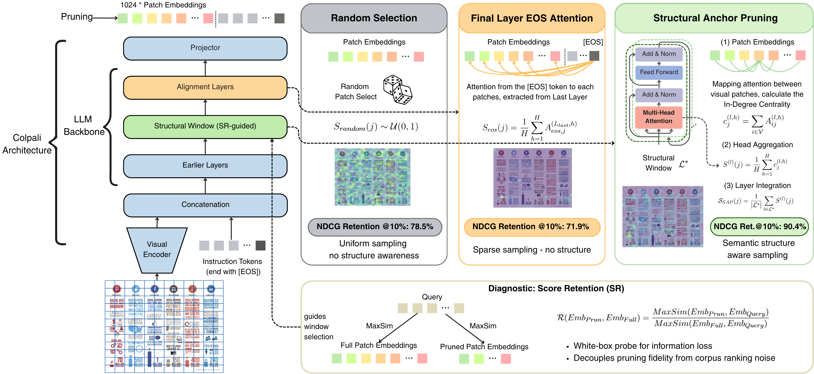

# Structural Anchor Pruning (SAP)

A training-free method for pruning visual token embeddings in VLM-based document retrieval systems.

**Paper (v2, current):** [Structural Anchor Pruning: Training-Free Multi-Vector Compression for Visual Document Retrieval](https://arxiv.org/abs/2601.20107)

> To reproduce the exact experimental results from the paper, use the original scripts in the [`experiments/`](experiments/) directory.

> ⭐ If you find this repository useful for your research, a GitHub star would be much appreciated! It helps others discover the project 🙌

<p align="center">
  
</p>

## Overview

Multi-vector Visual RAG models (ColPali, ColQwen2, Jina v4) produce hundreds of visual token embeddings per document page, leading to large index sizes. SAP identifies structurally important tokens using **visual in-degree centrality** from the model's own attention maps — no training, no external data, no task-specific tuning.

SAP has three components: (i) **Score Retention (SR)**, a white-box per-layer compression diagnostic; (ii) **SR-guided window selection**, a procedure that automatically locates the structural pruning region for any backbone with no per-model hyperparameters; and (iii) a **visual in-degree centrality** scorer that identifies anchor patches within the selected window.

Key insight: a backbone's *Structural Plateau* (the layers preceding the final alignment region) captures **layout structure** (headers, tables, regions), while the final layers reshape representations into a sparse, query-aligned form. By scoring tokens from the SR-selected window, SAP retains the embeddings that anchor document structure, achieving high score retention even at aggressive compression ratios (>90% NDCG@5 retention at 10× compression, 76--79% retention at 20× compression on ViDoRe v2).

## Installation

```bash
# Core (torch + numpy only)
pip install git+https://github.com/Ryenhails/structural-anchor-pruning.git

# With ColPali/ColQwen2 support
pip install "sap[colpali] @ git+https://github.com/Ryenhails/structural-anchor-pruning.git"

# With Jina V4 support
pip install "sap[jina] @ git+https://github.com/Ryenhails/structural-anchor-pruning.git"

# Development
git clone https://github.com/Ryenhails/structural-anchor-pruning.git
cd structural-anchor-pruning
pip install -e ".[dev]"
```

## Quick Start

### Pure tensor API (no model dependency)

```python
import torch
import sap

# Given: attention weights from a VLM forward pass
# attentions: tuple of [batch, heads, seq, seq] tensors (one per layer)
# visual_indices: 1-D tensor of visual token positions

# 1. Compute SAP importance scores
scores = sap.compute_sap_scores(
    attentions, visual_indices,
    target_layers=[8, 9, 10, 11],  # or model_name="colpali"
    agg_mode="mean",               # SAP-Mean (Eq. 3) or "max" (Eq. 4)
)

# 2. Prune to keep top 50% of visual tokens
pruned_embs = sap.prune_embeddings(visual_embeddings, scores, ratio=0.5)

# 3. Evaluate quality via Oracle Score Retention
osr = sap.compute_osr(query_embs, full_doc_embs, pruned_embs)
print(f"OSR: {osr:.4f}")  # 1.0 = perfect retention
```

### With ColPali model

```python
from colpali_engine.models import ColPali, ColPaliProcessor
from sap.attention.colpali import ColPaliAttentionExtractor
import sap

model = ColPali.from_pretrained("vidore/colpali-v1.2", device_map="cuda")
processor = ColPaliProcessor.from_pretrained("vidore/colpali-v1.2")
sap.ensure_eager_attention(model)  # Required for attention extraction

extractor = ColPaliAttentionExtractor(model, processor)

# Process an image
batch = processor.process_images([image]).to(model.device)
attentions, visual_indices = extractor.extract(batch)
embeddings = model(**batch)  # [1, seq_len, dim]

# Compute SAP scores and prune
scores = sap.compute_sap_scores(attentions, visual_indices, model_name="colpali")
visual_embs = embeddings[0, visual_indices]
pruned = sap.prune_embeddings(visual_embs, scores, ratio=0.5)
```

## API Reference

### Centrality (Eq. 2–4)

| Function | Description |
|----------|-------------|
| `compute_visual_centrality(layer_attn, visual_indices, agg_mode)` | In-degree centrality from a single layer |
| `compute_visual_centrality_batch(layer_attn, visual_indices, agg_mode)` | Batch variant |

### Scoring (Eq. 5–6)

| Function | Description |
|----------|-------------|
| `compute_sap_scores(attentions, visual_indices, target_layers, ...)` | Full SAP pipeline — average centrality across target layers |
| `get_default_layers(model_name)` | Default layer window for known models |
| `get_default_layers_by_depth(num_layers, start_pct, end_pct)` | Compute window from model depth |

### Score Retention & SR-Guided Window Selection (§3.2–3.3, Algorithm 1)

| Function | Description |
|----------|-------------|
| `compute_per_layer_sr(attentions, visual_indices, visual_embs, query_embs, ratio)` | Per-layer SR for one (query, doc) pair |
| `compute_random_sr_baseline(visual_embs, query_embs, ratio, num_seeds)` | Random-pruning SR baseline |
| `aggregate_calibration_sr(per_pair_sr)` | Mean / std across a calibration set |
| `select_sr_window(per_layer_sr, rho=0.2)` | Drop-alignment + top-ρ window selection (Algorithm 1) |

### Pruning

| Function | Description |
|----------|-------------|
| `prune_embeddings(embeddings, scores, ratio)` | Keep top-*ratio* tokens by score |
| `prune_embeddings_with_indices(embeddings, scores, ratio)` | Also returns selected indices |
| `prune_embeddings_batch(embeddings_list, scores_list, ratio)` | Batch variant |

### Evaluation (Eq. 1, 8)

| Function | Description |
|----------|-------------|
| `maxsim_score(query_embs, doc_embs)` | MaxSim late-interaction score |
| `maxsim_score_batched(query_embs, doc_embs)` | Batched MaxSim |
| `maxsim_score_matrix(query_list, doc_list, device)` | Full Q×D score matrix |
| `compute_osr(query, full_doc, pruned_doc)` | Oracle Score Retention |
| `compute_osr_batch(...)` | Batch OSR |

### Utilities

| Function | Description |
|----------|-------------|
| `ensure_eager_attention(model)` | Switch SDPA → eager for attention extraction |
| `detect_visual_indices_by_token_id(input_ids, token_id)` | Find visual tokens (PaliGemma) |
| `detect_visual_indices_by_range(input_ids, start_id, end_id)` | Find visual tokens (Qwen2-VL) |

## Auto Window Selection for an Unknown Backbone

For a backbone not listed in `DEFAULT_LAYERS`, locate the Structural Plateau automatically from a small unlabelled calibration set:

```python
import sap

# Per-pair SR curves on a calibration set of (image, query) pairs.
per_pair_sr = []
for image, query in calibration_set:
    attentions, visual_indices = extractor.extract(processor.process_images([image]))
    visual_embs = model(...)[0, visual_indices]
    query_embs = model(**processor.process_queries([query]))[0]
    per_pair_sr.append(
        sap.compute_per_layer_sr(
            attentions, visual_indices, visual_embs, query_embs, ratio=0.10,
        )
    )

agg = sap.aggregate_calibration_sr(per_pair_sr)         # mean / std per layer
window = sap.select_sr_window(agg["mean"], rho=0.2)     # Algorithm 1

print(window.layer_indices)      # e.g. [26, 27, 28, 29, 30, 31, 32, 33]
print(window.snapped_window)     # e.g. "70-90"

# Use the selected layers as target_layers in compute_sap_scores at index time.
scores = sap.compute_sap_scores(
    attentions, visual_indices, target_layers=window.layer_indices,
)
```

The paper uses `ratio=0.10` and `rho=0.2` with a 500-pair calibration set drawn from the ColPali training corpus (disjoint from ViDoRe).

## Default Layer Windows (v2: SR-guided)

The default windows below are the SR-guided selections from v2 of the paper, validated against a 9-window brute-force search on ViDoRe v1 and v2. For unknown backbones, use the auto-selection flow above or the reference scripts in [`experiments/`](experiments/).

| Model | Backbone | Layers | Window (relative depth) |
|-------|----------|--------|--------------------------|
| ColPali | PaliGemma-3B | 18 | `[11, 12, 13, 14]` (60--80%) |
| ColQwen2 | Qwen2-VL-2B | 28 | `[18, 19, 20, 21, 22, 23]` (60--80%) |
| Jina v4 | Qwen2.5-VL-3B | 36 | `[26, 27, 28, 29, 30, 31, 32, 33]` (70--90%) |

## Experiments

The `experiments/` directory contains the original benchmark scripts used in the paper. See [`experiments/README.md`](experiments/README.md) for usage instructions.

## Citation

```bibtex
@article{liu2026sap,
  title={Structural Anchor Pruning: Training-Free Multi-Vector Compression for Visual Document Retrieval},
  author={Liu, Zhuchenyang and Hu, Ziyu and Zhang, Yao and Xiao, Yu},
  journal={arXiv preprint arXiv:2601.20107},
  year={2026}
}
```
## Acknowledgements

This project has received funding from the **Business Finland** co-innovation programme under grant agreement No. 69/31/2025. It is supported by the [AiWo: Human-centric AI-enabled Collaborative Fieldwork Operations](https://aifieldwork.aalto.fi/events/) project (2025–2027), which aims to revolutionize fieldwork operations and enhance human-AI collaboration across the manufacturing, construction, and industrial design sectors. The calculations presented in this project were performed using computer resources within the Aalto University School of Science “Science-IT” project.

## License

MIT
